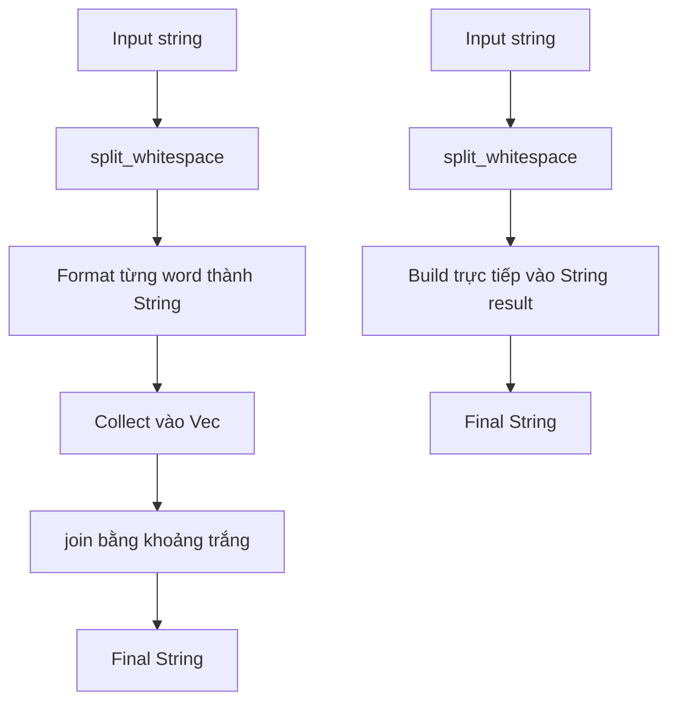

Có những bài toán nhìn qua tưởng rất nhỏ, nhưng khi bắt tay vào viết nghiêm túc lại mở ra khá nhiều điều đáng học. Một ví dụ điển hình là bài toán format tên.

Giả sử ta có một chuỗi tên người dùng nhập vào như sau:

```rust
" dAnG ViET hUNG "
```

Kết quả mong muốn là:

```rust
"Dang Viet Hung"
```

Nghe có vẻ đơn giản: bỏ khoảng trắng thừa, viết hoa chữ cái đầu mỗi từ, viết thường phần còn lại. Nhưng khi triển khai bằng Rust, bài toán này chạm tới nhiều chủ đề rất quan trọng: `String`, `&str`, iterator, allocation, Unicode, readability và cả câu hỏi quen thuộc trong lập trình hệ thống: **khi nào nên tối ưu?**

Trong bài viết này, tôi sẽ đi qua ba phiên bản triển khai:

* `format_name_original`: ưu tiên sự rõ ràng, dễ đọc.
* `format_name_optimized`: tối ưu bằng cách giảm allocation trung gian.
* `format_name_optimized_safe`: giữ ý tưởng tối ưu nhưng xử lý Unicode cẩn thận hơn.

Sau đó, tôi sẽ dùng `criterion` để benchmark các phiên bản này trên input nhỏ và input lớn. Mục tiêu không phải là chứng minh rằng một implementation `luôn luôn tốt hơn`, mà là hiểu rõ trade-off giữa readability, performance và correctness.

---

## Bài toán cần giải quyết

Yêu cầu của bài toán như sau:

Với một chuỗi tên đầu vào, ta cần chuẩn hóa nó về dạng gần giống `title case` đơn giản:

* Bỏ khoảng trắng thừa ở đầu và cuối chuỗi.
* Nếu giữa các từ có nhiều khoảng trắng, chuẩn hóa về một khoảng trắng.
* Mỗi từ có chữ cái đầu viết hoa.
* Phần còn lại của từ viết thường.

Ví dụ:

```rust
" dAnG ViET hUNG "
```

Sẽ trở thành:

```rust
"Dang Viet Hung"
```

Một vài ví dụ khác:

```rust
"   nGuYeN     vAn      a   "
// "Nguyen Van A"

" tRAN    tHI    bIch   nGOC "
// "Tran Thi Bich Ngoc"
```

Đây là dạng xử lý rất thường gặp trong các hệ thống thực tế: import dữ liệu người dùng, chuẩn hóa contact, xử lý CSV, làm sạch dữ liệu trong pipeline, hoặc format lại tên trước khi lưu vào database.

Ở quy mô nhỏ, bài toán này gần như không đáng lo về hiệu năng. Nhưng nếu đặt trong bối cảnh xử lý hàng trăm nghìn hoặc hàng triệu bản ghi, các chi phí nhỏ như tạo `String` trung gian, tạo `Vec`, copy dữ liệu hoặc cấp phát bộ nhớ nhiều lần có thể bắt đầu trở nên đáng quan tâm.

Đó là lý do bài toán nhỏ này rất phù hợp để học cách Rust xử lý chuỗi và bộ nhớ.

---

## Phiên bản đầu tiên: rõ ràng và dễ hiểu

Một cách triển khai tự nhiên trong Rust là dùng iterator chain:

```rust
pub fn format_name_original(name: &str) -> String {
    name.split_whitespace()
        .map(|word| {
            let mut chars = word.chars();

            match chars.next() {
                None => String::new(),
                Some(first) => {
                    let head = first.to_uppercase().collect::<String>();
                    let tail = chars.as_str().to_lowercase();

                    head + &tail
                }
            }
        })
        .collect::<Vec<String>>()
        .join(" ")
}
```

Nhìn từ trên xuống, flow xử lý khá dễ hiểu:

1. `split_whitespace()` để tách chuỗi thành các từ.
2. `map()` để format từng từ.
3. `collect::<Vec<String>>()` để gom các từ đã format vào một vector.
4. `join(" ")` để nối các từ lại bằng một dấu cách.

Đây là kiểu code rất phù hợp khi mới học Rust. Nó tận dụng iterator, viết gọn, biểu đạt rõ ý định và gần với cách ta mô tả bài toán bằng ngôn ngữ tự nhiên:

```text
Tách chuỗi thành từng từ
--> Format từng từ
--> Gom các từ lại
--> Nối bằng khoảng trắng
```

Nếu đọc đoạn code này, ta gần như có thể hiểu ngay chương trình đang làm gì mà không cần phân tích quá sâu về memory.

---

## Vì sao `split_whitespace()` rất phù hợp ở đây?

Trong bài toán format tên, khoảng trắng là một vấn đề nhỏ nhưng rất dễ gây lỗi nếu xử lý thủ công.

Input có thể là:

```rust
" dAnG ViET hUNG "
```

Hoặc:

```rust
"   dAnG     ViET      hUNG   "
```

Ta không muốn giữ nguyên số lượng khoảng trắng đó. Ta muốn coi các cụm khoảng trắng chỉ là dấu phân tách giữa các từ.

Đó là lý do `split_whitespace()` rất phù hợp. Nó tự động bỏ qua các khoảng trắng thừa và chỉ trả về các phần tử thực sự là từ.

Ví dụ:

```rust
let words: Vec<&str> = "   dAnG     ViET      hUNG   "
    .split_whitespace()
    .collect();

assert_eq!(words, vec!["dAnG", "ViET", "hUNG"]);
```

Nhờ vậy, ta không cần tự `trim()`, không cần tự kiểm tra nhiều khoảng trắng liên tiếp, cũng không cần viết logic phức tạp để normalize input.

---

## Vì sao phải dùng `chars()`?

Nếu từng làm việc với một số ngôn ngữ khác, ta có thể quen với việc lấy ký tự đầu tiên bằng index, ví dụ `word[0]`.

Nhưng trong Rust, `String` và `&str` được lưu dưới dạng UTF-8. Điều này có nghĩa là một ký tự có thể chiếm nhiều hơn một byte.

Vì vậy, Rust không cho phép index trực tiếp vào string theo kiểu:

```rust
let first = word[0];
```

Cách đúng hơn là duyệt theo ký tự bằng `chars()`:

```rust
let mut chars = word.chars();

match chars.next() {
    Some(first) => {
        // xử lý ký tự đầu tiên
    }
    None => {
        // word rỗng
    }
}
```

Trong bài toán này, sau khi lấy ký tự đầu tiên bằng `chars.next()`, phần còn lại của từ có thể lấy bằng:

```rust
chars.as_str()
```

Sau đó ta chuyển phần còn lại sang lowercase:

```rust
chars.as_str().to_lowercase()
```

Đây là một điểm khá hay trong Rust: xử lý string có thể không `nhanh tay` như một số ngôn ngữ khác, nhưng đổi lại ta buộc phải suy nghĩ rõ ràng hơn về UTF-8 và tính đúng đắn của dữ liệu.

---

## Phân tích phiên bản original

Đoạn xử lý chính nằm ở đây:

```rust
match chars.next() {
    None => String::new(),
    Some(first) => {
        let head = first.to_uppercase().collect::<String>();
        let tail = chars.as_str().to_lowercase();

        head + &tail
    }
}
```

Với mỗi từ:

* Lấy ký tự đầu tiên.
* Chuyển ký tự đầu tiên sang uppercase.
* Lấy phần còn lại của từ.
* Chuyển phần còn lại sang lowercase.
* Ghép hai phần lại thành một `String`.

Ví dụ với từ:

```rust
"dAnG"
```

Ta có:

```rust
first = 'd'
rest = "AnG"
```

Sau khi xử lý:

```rust
"D" + "ang" = "Dang"
```

Về mặt readability, đây là một phiên bản rất ổn. Code rõ ràng, dễ đọc, dễ giải thích, phù hợp cho đa số tình huống thông thường.

Tuy nhiên, nếu nhìn sâu hơn vào allocation, ta sẽ thấy phiên bản này có một vài chi phí trung gian.

---

## Vấn đề allocation trong phiên bản original

Điểm đáng chú ý nhất ở phiên bản original là đoạn:

```rust
.collect::<Vec<String>>()
.join(" ")
```

Điều này có nghĩa là sau khi format từng từ, chương trình sẽ:

1. Tạo một `String` mới cho từng từ.
2. Gom các `String` đó vào một `Vec<String>`.
3. Sau đó `join(" ")` lại để tạo ra `String` kết quả cuối cùng.

Với input:

```rust
" dAnG ViET hUNG "
```

Quá trình xử lý có thể hình dung như sau:

```text
Input:
" dAnG ViET hUNG "

split_whitespace:
"dAnG", "ViET", "hUNG"

map:
"Dang", "Viet", "Hung"

collect:
Vec<String> = ["Dang", "Viet", "Hung"]

join:
"Dang Viet Hung"
```

Ở đây, ta có nhiều dữ liệu trung gian:

```text
String "Dang"
String "Viet"
String "Hung"
Vec<String>
String cuối cùng "Dang Viet Hung"
```

Với một tên ngắn, chi phí này gần như không đáng kể. Nhưng nếu ta đang xử lý hàng trăm nghìn hoặc hàng triệu dòng dữ liệu, ví dụ normalize danh sách khách hàng từ file CSV, thì số lượng allocation nhỏ này có thể cộng dồn thành chi phí đáng quan tâm.

Lúc này, ta có thể nghĩ tới một hướng tối ưu hơn: thay vì tạo `Vec<String>` rồi `join`, ta build trực tiếp chuỗi kết quả cuối cùng.



---

## Phiên bản optimized: build trực tiếp vào `String`

Một hướng tối ưu là dùng `String::with_capacity()` để tạo trước buffer kết quả, sau đó lần lượt ghi dữ liệu vào buffer này.

```rust
pub fn format_name_optimized(name: &str) -> String {
    let mut result = String::with_capacity(name.len());
    let mut words = name.split_whitespace().peekable();

    while let Some(word) = words.next() {
        let mut chars = word.chars();

        if let Some(first) = chars.next() {
            result.extend(first.to_uppercase());

            for c in chars {
                result.push(c.to_lowercase().next().unwrap());
            }
        }

        if words.peek().is_some() {
            result.push(' ');
        }
    }

    result
}
```

Ý tưởng của phiên bản này là:

* Tạo một `String` kết quả ngay từ đầu.
* Duyệt từng word.
* Format trực tiếp từng ký tự vào `result`.
* Nếu phía sau vẫn còn word, thêm một dấu cách.
* Trả về `result`.

Điểm đáng chú ý là:

```rust
let mut result = String::with_capacity(name.len());
```

Ta cấp phát trước dung lượng gần bằng độ dài input ban đầu. Đây không phải lúc nào cũng chính xác tuyệt đối, vì uppercase/lowercase Unicode có thể làm thay đổi số byte. Nhưng trong nhiều trường hợp thông thường, nó là một ước lượng hợp lý.

Mục tiêu ở đây là giảm số lần cấp phát lại bộ nhớ khi `String` lớn dần.

---

## `peekable()` dùng để làm gì?

Trong phiên bản optimized, ta thấy đoạn:

```rust
let mut words = name.split_whitespace().peekable();
```

Sau khi xử lý xong một word, ta cần biết có nên thêm dấu cách hay không.

Nếu cứ thêm dấu cách sau mỗi word, kết quả sẽ bị thừa một dấu cách ở cuối:

```rust
"Dang Viet Hung "
```

Ta không muốn điều đó.

Vì vậy, ta dùng:

```rust
if words.peek().is_some() {
    result.push(' ');
}
```

`peek()` cho phép nhìn trước xem iterator còn phần tử tiếp theo hay không, nhưng không lấy phần tử đó ra khỏi iterator.

Nói cách khác:

* Nếu còn word phía sau, thêm dấu cách.
* Nếu đây là word cuối cùng, không thêm gì nữa.

Đây là một kỹ thuật nhỏ nhưng rất hữu ích khi build string thủ công.

---

## Vì sao gọi là tối ưu allocation?

Trong bài toán này, điểm khác biệt chính giữa hai cách viết không phải là thuật toán. Cả hai phiên bản đều duyệt qua từng từ và xử lý từng ký tự.

Khác biệt nằm ở cách tạo output.

Phiên bản original có flow:

```text
split_whitespace
--> map từng word thành String mới
--> collect thành Vec<String>
--> join thành String cuối cùng
```

Phiên bản optimized có flow:

```text
tạo một String result
--> duyệt từng word
--> ghi trực tiếp vào result
--> trả về result
```

Với bản original, chương trình tạo nhiều object trung gian. Với bản optimized, chương trình cố gắng build trực tiếp vào một `String` kết quả.

Đây chính là ý nghĩa của `tối ưu allocation`: giảm số lần cấp phát bộ nhớ và giảm các object trung gian không cần thiết trong quá trình tạo output.

Tuy nhiên, cần nhấn mạnh rằng đây là một dạng micro-optimization. Không nên mặc định rằng bản optimized luôn tốt hơn trong mọi trường hợp. Với input nhỏ, bản original có thể đã đủ tốt và dễ maintain hơn nhiều.

---

## `String::with_capacity(name.len())` có thật sự chính xác không?

Trong bản optimized, ta dùng:

```rust
let mut result = String::with_capacity(name.len());
```

Ý tưởng là cấp phát trước một vùng nhớ đủ lớn gần bằng độ dài chuỗi input ban đầu.

Điều này hợp lý vì output thường có độ dài gần giống input. Ví dụ:

```text
Input : " dAnG ViET hUNG "
Output: "Dang Viet Hung"
```

Output có thể ngắn hơn input do bị loại bỏ khoảng trắng thừa ở đầu và cuối. Nhưng nhìn chung, độ dài input là một ước lượng khá ổn cho capacity ban đầu.

Tuy nhiên, cần lưu ý rằng `name.len()` trong Rust trả về số byte, không phải số ký tự. Với chuỗi ASCII, số byte và số ký tự thường giống nhau. Nhưng với Unicode, ví dụ tiếng Việt có dấu, một ký tự có thể chiếm nhiều byte.

Ngoài ra, khi chuyển đổi uppercase hoặc lowercase, số byte của kết quả có thể thay đổi. Vì vậy, `with_capacity(name.len())` không phải là một cam kết tuyệt đối rằng chuỗi kết quả sẽ không bao giờ cần cấp phát thêm. Nó chỉ là một chiến lược ước lượng ban đầu để giảm khả năng phải reallocation trong quá trình build chuỗi.

Đây là một điểm rất thực tế khi tối ưu Rust: ta không nhất thiết phải biết chính xác capacity cuối cùng, nhưng nếu có thể đưa ra một ước lượng hợp lý, ta đã giúp `String` làm việc hiệu quả hơn.

---

## Một vấn đề ẩn: Unicode correctness

Đến đây, phiên bản optimized có vẻ khá hợp lý. Tuy nhiên, có một dòng cần phân tích kỹ:

```rust
result.push(c.to_lowercase().next().unwrap());
```

Dòng này có vẻ vô hại: chuyển một ký tự sang lowercase rồi push vào kết quả.

Nhưng trong Rust, `to_lowercase()` không trả về một `char`. Nó trả về một iterator.

Lý do là trong Unicode, việc chuyển hoa/thường không phải lúc nào cũng là quan hệ một-một. Một ký tự khi chuyển đổi case có thể sinh ra nhiều ký tự.

Vì vậy, nếu ta gọi:

```rust
c.to_lowercase().next().unwrap()
```

Ta chỉ lấy ký tự đầu tiên trong kết quả lowercase và bỏ qua các ký tự còn lại nếu có.

Với tiếng Anh hoặc tiếng Việt thông thường, có thể ta chưa gặp vấn đề ngay. Nhưng nếu viết code xử lý text một cách tổng quát, đây là một giả định không thật sự an toàn.

Bài học ở đây là: khi tối ưu, ta không được vô tình làm mất correctness.

---

## Phiên bản optimized an toàn hơn

Thay vì dùng:

```rust
result.push(c.to_lowercase().next().unwrap());
```

Ta nên dùng:

```rust
result.extend(c.to_lowercase());
```

Vì `to_lowercase()` trả về iterator, `extend()` sẽ thêm toàn bộ các ký tự được sinh ra vào `result`, thay vì chỉ lấy ký tự đầu tiên.

Một phiên bản optimized an toàn hơn có thể viết như sau:

```rust
pub fn format_name_optimized_safe(name: &str) -> String {
    let mut result = String::with_capacity(name.len());
    let mut words = name.split_whitespace().peekable();

    while let Some(word) = words.next() {
        let mut chars = word.chars();

        if let Some(first) = chars.next() {
            result.extend(first.to_uppercase());

            for c in chars {
                result.extend(c.to_lowercase());
            }
        }

        if words.peek().is_some() {
            result.push(' ');
        }
    }

    result
}
```

Phiên bản này vẫn giữ được ý tưởng tối ưu:

* Không tạo `Vec<String>` trung gian.
* Build trực tiếp vào `result`.
* Dùng `String::with_capacity()` để giảm khả năng reallocation.

Nhưng đồng thời nó xử lý Unicode cẩn thận hơn.

Đây là kiểu cải thiện rất đáng giá: không chỉ tối ưu hơn, mà còn đúng hơn về mặt mô hình dữ liệu.

---

## So sánh ba phiên bản

Ta có thể tóm tắt ba phiên bản như sau:

| Phiên bản                    | Mục tiêu chính                      | Ưu điểm                                                 | Điểm cần chú ý                      |
| ---------------------------- | ----------------------------------- | ------------------------------------------------------- | ----------------------------------- |
| `format_name_original`       | Readability                         | Dễ đọc, dễ hiểu, phù hợp để học Rust                    | Có `Vec<String>` trung gian         |
| `format_name_optimized`      | Giảm allocation trung gian          | Build trực tiếp vào `String`, nhanh hơn trong benchmark | Chưa cẩn thận với Unicode expansion |
| `format_name_optimized_safe` | Cân bằng performance và correctness | Tránh `Vec<String>` trung gian, xử lý Unicode tốt hơn   | Code dài hơn bản original           |

Điều quan trọng là: **optimized không có nghĩa là luôn tốt hơn**.

Trong lập trình thực tế, một đoạn code dễ đọc, dễ maintain thường có giá trị rất lớn. Nếu function này không nằm trong hot path, không xử lý dữ liệu lớn, hoặc không gây bottleneck, phiên bản original có thể là lựa chọn tốt hơn.

Ngược lại, nếu đây là một phần trong pipeline xử lý dữ liệu lớn, được gọi hàng triệu lần, thì việc giảm allocation trung gian có thể đáng để cân nhắc.

---

## Vì sao không nên chỉ nhìn vào code rồi kết luận?

Khi nhìn vào ba phiên bản, ta có thể dễ dàng nghĩ rằng bản optimized chắc chắn nhanh hơn.

Nhưng trong kỹ thuật phần mềm, đặc biệt là performance engineering, trực giác không đủ. Có nhiều yếu tố có thể ảnh hưởng đến kết quả:

* Compiler có thể tối ưu code theo cách ta không nhìn thấy trực tiếp.
* Input nhỏ có thể khiến khác biệt gần như không đáng kể.
* Allocation ít hơn chưa chắc luôn dẫn đến cải thiện lớn về thời gian chạy.
* Code dài hơn có thể làm tăng chi phí maintain.
* Unicode correctness có thể bị ảnh hưởng nếu tối ưu không cẩn thận.

Vì vậy, thay vì nói `bản này nhanh hơn vì nhìn có vẻ tối ưu hơn`, cách tiếp cận tốt hơn là benchmark.

Benchmark giúp ta chuyển từ suy đoán sang đo đạc.

---

## Thiết kế benchmark

Để đánh giá các phiên bản, tôi dùng `criterion`.

Benchmark được chia thành hai nhóm:

* `Small_Scale_Naming`: đo với input nhỏ, gần với case format một tên thông thường.
* `Large_Scale_Naming`: đo với input lớn hơn, mô phỏng workload xử lý dữ liệu hàng loạt.

Với input lớn, tôi tạo dữ liệu bằng cách repeat một chuỗi mẫu nhiều lần:

```rust
let base_input =
    "nguyen van a mang tinh chat minh hoa cho mot chuoi rat dai de test hieu nang ";

let large_input = base_input.repeat(1000);
```

Lý do dùng input lớn là để làm rõ sự khác biệt giữa các cách xử lý. Nếu chỉ benchmark với một tên ngắn như:

```rust
" dAnG ViET hUNG "
```

Thì thời gian chạy quá nhỏ, khác biệt giữa các implementation có thể bị nhiễu bởi nhiều yếu tố khác.

Với input lớn hơn, benchmark mô phỏng gần hơn các tình huống như:

* Normalize dữ liệu trong file CSV lớn.
* Xử lý batch user profile.
* Làm sạch dữ liệu text trong pipeline.
* Chạy format function lặp lại nhiều lần.

Cấu hình benchmark:

```rust
use criterion::{Criterion, criterion_group, criterion_main};
use format_name::{format_name_optimized, format_name_optimized_safe, format_name_original};
use std::hint::black_box;
use std::time::Duration;

fn bench_large_scale_naming(c: &mut Criterion) {
    let base_input =
        "nguyen van a mang tinh chat minh hoa cho mot chuoi rat dai de test hieu nang ";

    let large_input = base_input.repeat(1000);

    let mut group = c.benchmark_group("Large_Scale_Naming");

    group.sample_size(50);
    group.measurement_time(Duration::from_secs(10));

    group.bench_function("Original_Vec_Join_Large", |b| {
        b.iter(|| format_name_original(black_box(&large_input)))
    });

    group.bench_function("Optimized_Single_Alloc_Large", |b| {
        b.iter(|| format_name_optimized(black_box(&large_input)))
    });

    group.bench_function("Optimized_Single_Alloc_Safe_Large", |b| {
        b.iter(|| format_name_optimized_safe(black_box(&large_input)))
    });

    group.finish();
}

fn bench_small_naming(c: &mut Criterion) {
    let input = " dAnG ViET hUNG ";

    let mut group = c.benchmark_group("Small_Scale_Naming");

    group.sample_size(50);
    group.measurement_time(Duration::from_secs(10));

    group.bench_function("Original_Vec_Join_Small", |b| {
        b.iter(|| format_name_original(black_box(input)))
    });

    group.bench_function("Optimized_Single_Alloc_Small", |b| {
        b.iter(|| format_name_optimized(black_box(input)))
    });

    group.bench_function("Optimized_Single_Alloc_Safe_Small", |b| {
        b.iter(|| format_name_optimized_safe(black_box(input)))
    });

    group.finish();
}

criterion_group!(benches, bench_small_naming, bench_large_scale_naming);
criterion_main!(benches);
```

---

## Vai trò của `black_box`

Trong benchmark, tôi dùng:

```rust
black_box(input)
```

và:

```rust
black_box(&large_input)
```

Mục đích của `black_box` là hạn chế compiler tối ưu quá mức trong quá trình benchmark.

Nếu compiler nhận ra input hoặc kết quả có thể được tối ưu bỏ đi, benchmark có thể không còn phản ánh đúng chi phí thực tế của function. `black_box` giúp `che` giá trị khỏi một số tối ưu hóa, khiến benchmark gần hơn với việc function thật sự được gọi trong runtime.

Điều này đặc biệt quan trọng khi benchmark các hàm nhỏ, vì compiler rất giỏi trong việc inline, constant folding hoặc loại bỏ những tính toán không ảnh hưởng đến kết quả cuối cùng.

Nói đơn giản: `black_box` giúp benchmark bớt `ảo`.

---

## Kết quả benchmark thực tế

Sau khi chạy:

```bash
cargo bench
```

Tôi thu được kết quả như sau:

```text
Gnuplot not found, using plotters backend

Small_Scale_Naming/Original_Vec_Join_Small
time: [356.18 ns 357.64 ns 359.21 ns]

Small_Scale_Naming/Optimized_Single_Alloc_Small
time: [134.71 ns 137.12 ns 140.35 ns]

Small_Scale_Naming/Optimized_Single_Alloc_Safe_Small
time: [152.30 ns 160.39 ns 168.83 ns]

Large_Scale_Naming/Original_Vec_Join_Large
time: [1.8611 ms 1.8807 ms 1.9002 ms]

Large_Scale_Naming/Optimized_Single_Alloc_Large
time: [597.20 µs 616.47 µs 631.51 µs]

Large_Scale_Naming/Optimized_Single_Alloc_Safe_Large
time: [581.66 µs 601.78 µs 617.71 µs]
```

Có thể tóm tắt kết quả như sau:

| Benchmark   | `format_name_original` | `format_name_optimized` | `format_name_optimized_safe` |
| ----------- | ---------------------: | ----------------------: | ---------------------------: |
| Small input |             ~357.64 ns |              ~137.12 ns |                   ~160.39 ns |
| Large input |             ~1.8807 ms |              ~616.47 µs |                   ~601.78 µs |

Với input nhỏ, `format_name_optimized` nhanh hơn `format_name_original` khoảng 2.61 lần. Trong khi đó, `format_name_optimized_safe` nhanh hơn `format_name_original` khoảng 2.23 lần.

Với input lớn, sự khác biệt rõ hơn. `format_name_optimized` nhanh hơn `format_name_original` khoảng 3.05 lần, còn `format_name_optimized_safe` nhanh hơn khoảng 3.13 lần.

Điều này cho thấy giả thuyết ban đầu là hợp lý: việc tránh `Vec<String>` trung gian và build trực tiếp vào một `String` có thể tạo ra cải thiện rõ ràng về hiệu năng, đặc biệt khi input lớn hơn.

---

## Cách đọc kết quả benchmark

Khi đọc kết quả Criterion, phần quan trọng nhất trong bài này là dòng `time`.

Ví dụ:

```text
time: [356.18 ns 357.64 ns 359.21 ns]
```

Có thể hiểu đơn giản:

* `356.18 ns`: cận dưới của khoảng ước lượng.
* `357.64 ns`: giá trị ước lượng trung tâm.
* `359.21 ns`: cận trên của khoảng ước lượng.

Khi so sánh các implementation, tôi dùng giá trị ở giữa để tính tương đối.

Dòng:

```text
Gnuplot not found, using plotters backend
```

không phải lỗi. Criterion chỉ thông báo rằng máy không có Gnuplot nên dùng `plotters` backend để tạo report. Benchmark vẫn chạy bình thường.

Một số benchmark có outlier, ví dụ:

```text
Found 3 outliers among 50 measurements (6.00%)
```

Điều này cũng khá bình thường khi benchmark trên máy cá nhân. Hệ điều hành, background process, CPU scheduling hoặc thermal behavior đều có thể làm một số lần đo bị lệch. Vì vậy, benchmark nên được hiểu như một tín hiệu thực nghiệm có kiểm soát, không phải một chân lý tuyệt đối cho mọi môi trường.

---

## Benchmark hiện tại đang đo gì?

Benchmark hiện tại đo thời gian thực thi của ba implementation trên input nhỏ và input lớn.

Cụ thể, nó trả lời câu hỏi:

> Với workload benchmark hiện tại, phiên bản nào xử lý nhanh hơn?

Đây là một câu hỏi hợp lý, nhưng cần hiểu đúng phạm vi của nó.

Benchmark này đo thời gian chạy, nhưng không trực tiếp đo số lần allocation. Nếu ta muốn biết chính xác mỗi phiên bản cấp phát bao nhiêu lần, cấp phát bao nhiêu byte, hoặc reallocation diễn ra ra sao, ta cần thêm công cụ profiling hoặc allocator instrumentation.

Vì vậy, cách diễn đạt chính xác là:

> Phiên bản optimized được thiết kế để giảm allocation trung gian. Benchmark cho thấy thiết kế này đem lại cải thiện rõ rệt về thời gian chạy trong workload được kiểm thử.

Không nên diễn đạt quá mạnh rằng benchmark này đã chứng minh toàn bộ chi phí allocation của từng phiên bản, vì hiện tại benchmark chưa trực tiếp đo allocation.

---

## Điều thú vị từ kết quả

Kết quả benchmark có hai điểm đáng chú ý.

Thứ nhất, hai phiên bản optimized đều nhanh hơn rõ rệt so với phiên bản original.

Điều này khá dễ hiểu: bản original tạo `String` cho từng word, gom vào `Vec<String>`, sau đó mới `join` lại. Trong khi đó, hai bản optimized ghi trực tiếp vào một `String` kết quả.

Thứ hai, `format_name_optimized_safe` không phải lúc nào cũng nhanh hơn `format_name_optimized`.

Ở small input, `format_name_optimized` nhanh hơn `format_name_optimized_safe`:

```text
format_name_optimized      : ~137.12 ns
format_name_optimized_safe : ~160.39 ns
```

Điều này hợp lý, vì bản safe dùng:

```rust
result.extend(c.to_lowercase());
```

Thay vì:

```rust
result.push(c.to_lowercase().next().unwrap());
```

Bản safe làm đúng hơn về mặt Unicode, nhưng cũng có thể phải xử lý iterator đầy đủ hơn.

Tuy nhiên, ở large input, `format_name_optimized_safe` lại nhỉnh hơn một chút:

```text
format_name_optimized      : ~616.47 µs
format_name_optimized_safe : ~601.78 µs
```

Sự khác biệt này không nên được diễn giải quá mức. Với benchmark thực tế, những chênh lệch nhỏ giữa hai phiên bản optimized có thể chịu ảnh hưởng từ nhiều yếu tố như compiler optimization, CPU cache, branch behavior hoặc nhiễu hệ thống.

Kết luận:

* Cả hai phiên bản optimized đều nhanh hơn rõ rệt so với bản original trong benchmark này.
* Bản optimized safe có lợi thế về correctness.
* Nếu dùng trong production và vẫn muốn tối ưu, `format_name_optimized_safe` là lựa chọn cân bằng hơn.

---

## Một benchmark tốt cần đi cùng test correctness

Benchmark chỉ cho biết code chạy nhanh hay chậm. Nó không cho biết code có đúng hay không.

Với bài toán format tên, ta vẫn cần test correctness cho nhiều loại input khác nhau.

Ví dụ, test case cơ bản:

```rust
#[test]
fn test_basic_name() {
    assert_eq!(
        format_name_original(" dAnG ViET hUNG "),
        "Dang Viet Hung"
    );
}
```

Test nhiều khoảng trắng:

```rust
#[test]
fn test_multiple_spaces() {
    assert_eq!(
        format_name_original("   nGuYeN     vAn      a   "),
        "Nguyen Van A"
    );
}
```

Test chuỗi rỗng:

```rust
#[test]
fn test_empty_string() {
    assert_eq!(format_name_original(""), "");
}
```

Test chuỗi chỉ có khoảng trắng:

```rust
#[test]
fn test_only_whitespace() {
    assert_eq!(format_name_original("     "), "");
}
```

Test tiếng Việt có dấu:

```rust
#[test]
fn test_vietnamese_name() {
    assert_eq!(
        format_name_original(" đẶnG vIệT hƯnG "),
        "Đặng Việt Hưng"
    );
}
```

Và đặc biệt, test cho case Unicode expansion:

```rust
#[test]
fn test_safe_version_matches_original_for_unicode_expansion() {
    let input = "Aİ";

    assert_eq!(
        format_name_optimized_safe(input),
        format_name_original(input)
    );
}

#[test]
fn test_optimized_version_can_drop_unicode_expansion() {
    let input = "Aİ";

    assert_ne!(
        format_name_optimized(input),
        format_name_original(input)
    );
}
```

Điểm quan trọng là: performance optimization không được làm mất correctness.

Nếu một phiên bản nhanh hơn nhưng xử lý sai Unicode hoặc sai edge case, phiên bản đó không nên được dùng trong production.

---

## Cấu trúc demo project

Cấu trúc project:

```text
format-name/
├── Cargo.toml
├── src/
│   ├── lib.rs
│   └── main.rs
└── benches/
    └── format_benchmark.rs
```

`Cargo.toml`:

```toml
[package]
name = "format-name"
version = "0.1.0"
edition = "2024"

[dependencies]

[dev-dependencies]
criterion = { version = "0.8.2", features = ["html_reports"] }

[[bench]]
name = "format_benchmark"
harness = false
```

`src/main.rs`:

```rust
use format_name::{
    format_name_optimized,
    format_name_optimized_safe,
    format_name_original,
};

fn main() {
    let input: &str = " dAnG ViET  hUNG ";

    let original = format_name_original(input);
    let optimized = format_name_optimized(input);
    let optimized_safe = format_name_optimized_safe(input);

    println!("Input          : {:?}", input);
    println!("Original       : {:?}", original);
    println!("Optimized      : {:?}", optimized);
    println!("Optimized safe : {:?}", optimized_safe);
}
```

Chạy demo:

```bash
cargo run
```

Chạy test:

```bash
cargo test
```

Chạy benchmark:

```bash
cargo bench
```

Source code: `https://github.com/hungdv98/format-name`

---

## Nên chọn phiên bản nào?

Ta có thể tóm tắt lựa chọn như sau:

| Tình huống                                            | Nên ưu tiên                                                |
| ----------------------------------------------------- | ---------------------------------------------------------- |
| Code demo, học Rust, xử lý input nhỏ                  | `format_name_original`                                     |
| Business logic thông thường, không nằm trong hot path | `format_name_original`                                     |
| Batch job, ETL, xử lý dữ liệu lớn                     | Benchmark bản optimized                                    |
| Production có Unicode                                 | Ưu tiên correctness, cân nhắc `format_name_optimized_safe` |
| Chưa có bottleneck rõ ràng                            | Không tối ưu sớm                                           |
| Đã có profiling chứng minh allocation là vấn đề       | Dùng bản optimized hoặc optimized safe                     |

Nếu mục tiêu là học Rust, tôi khuyên nên bắt đầu với phiên bản original.

Nó giúp ta hiểu các khái niệm nền tảng:

* `&str`
* `String`
* `split_whitespace`
* `chars`
* `map`
* `collect`
* `join`

Sau đó, khi đã hiểu rõ flow xử lý, hãy chuyển sang phiên bản optimized để học tiếp về:

* allocation
* `String::with_capacity`
* build string thủ công
* `peekable`
* `push`
* `extend`
* Unicode case conversion
* benchmark bằng `criterion`

Trong production, lựa chọn phụ thuộc vào ngữ cảnh.

Nếu function này không phải bottleneck, hãy ưu tiên code dễ đọc. Nếu function này nằm trong pipeline xử lý dữ liệu lớn, hãy benchmark và cân nhắc bản optimized an toàn hơn.

---

## Bài học Rust từ ví dụ này

Bài toán này cho thấy một số đặc điểm rất đáng học của Rust.

Thứ nhất, Rust khiến allocation trở nên rõ ràng hơn. Khi ta viết:

```rust
collect::<Vec<String>>()
```

Ta biết mình đang tạo một collection trung gian.

Khi ta viết:

```rust
String::with_capacity(name.len())
```

Ta đang chủ động kiểm soát capacity ban đầu của buffer.

Thứ hai, Rust buộc ta cẩn thận với string. Vì `String` là UTF-8, ta không thể tùy tiện index vào chuỗi như một mảng byte. Điều này ban đầu có thể hơi khó chịu, nhưng nó giúp ta tránh nhiều lỗi xử lý text.

Thứ ba, Rust API thường phản ánh sự phức tạp thật của dữ liệu. Việc `to_uppercase()` và `to_lowercase()` trả về iterator thay vì một `char` duy nhất là một ví dụ rất tốt. API này nhắc ta rằng Unicode case conversion không đơn giản như nhiều người nghĩ.

Thứ tư, Rust khuyến khích ta benchmark thay vì đoán. Một thay đổi nhìn có vẻ tối ưu hơn cần được kiểm chứng bằng số liệu, đặc biệt khi đánh đổi readability.

---

## Kết luận

Từ một bài toán nhỏ như format tên, ta có thể học được khá nhiều điều về Rust.

Phiên bản original cho thấy sức mạnh của iterator chain: code ngắn, rõ ràng và gần với cách ta mô tả bài toán bằng ngôn ngữ tự nhiên.

Phiên bản optimized cho thấy cách suy nghĩ về allocation: tránh tạo `Vec<String>` trung gian, build trực tiếp vào `String`, dùng `with_capacity` để giảm khả năng reallocation.

Phiên bản optimized safe nhắc ta rằng performance không nên đánh đổi correctness, đặc biệt khi làm việc với Unicode.

Benchmark giúp đưa cuộc thảo luận từ cảm tính sang thực nghiệm. Trong kết quả hiện tại, hai phiên bản optimized nhanh hơn rõ rệt so với phiên bản original. Với input nhỏ, `format_name_optimized` nhanh hơn khoảng 2.61 lần, còn `format_name_optimized_safe` nhanh hơn khoảng 2.23 lần. Với input lớn, hai bản optimized nhanh hơn khoảng 3 lần so với bản original.

Tuy nhiên, lựa chọn implementation vẫn nên phụ thuộc vào ngữ cảnh. Với code thông thường, readability của bản original là một lợi thế lớn. Với batch job, ETL hoặc hot path, bản optimized safe là lựa chọn cân bằng hơn vì vừa nhanh, vừa cẩn thận hơn với Unicode.

Bài học cuối cùng là: viết Rust tốt không chỉ là viết code nhanh. Viết Rust tốt là hiểu rõ dữ liệu, hiểu rõ allocation, biết khi nào nên dùng abstraction, biết khi nào nên tối ưu thủ công, và quan trọng nhất là luôn đo đạc trước khi kết luận.

Trong thực tế, lựa chọn tốt nhất thường không phải là phiên bản `ngắn nhất` hay `nhanh nhất` một cách tuyệt đối. Lựa chọn tốt nhất là phiên bản phù hợp nhất với ngữ cảnh: đủ đúng, đủ nhanh, đủ dễ hiểu và đủ dễ bảo trì.
